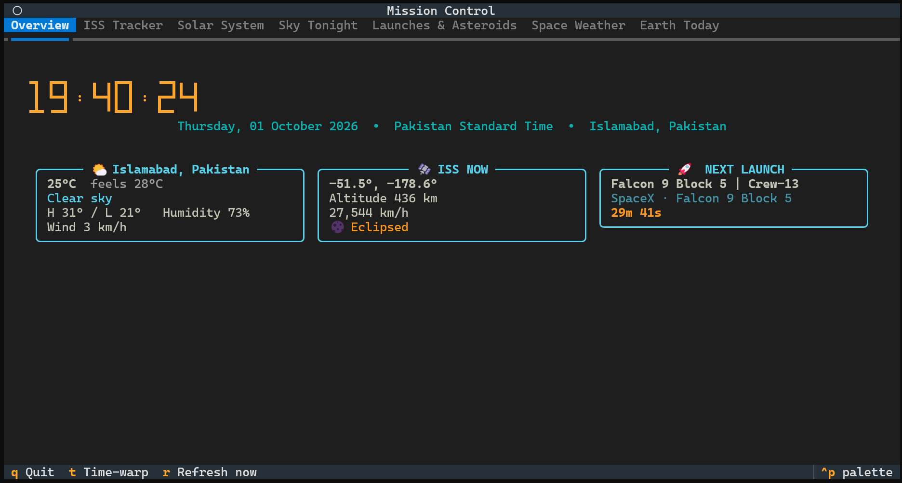
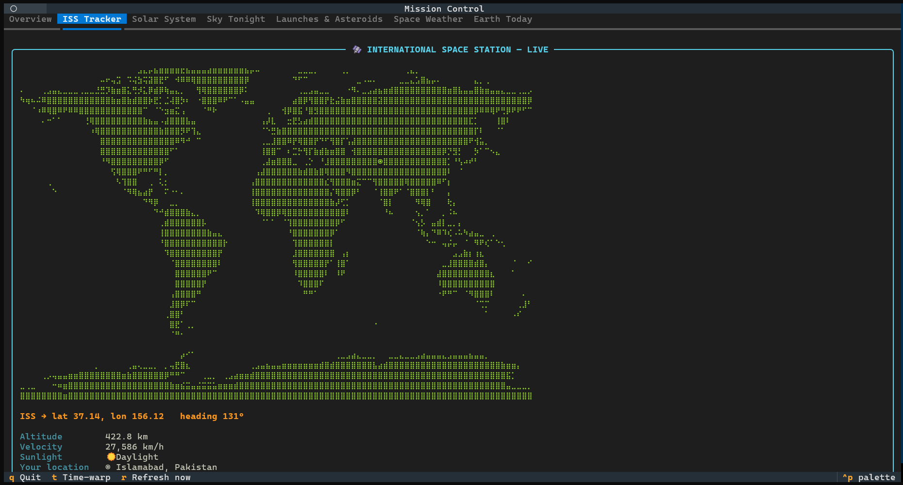
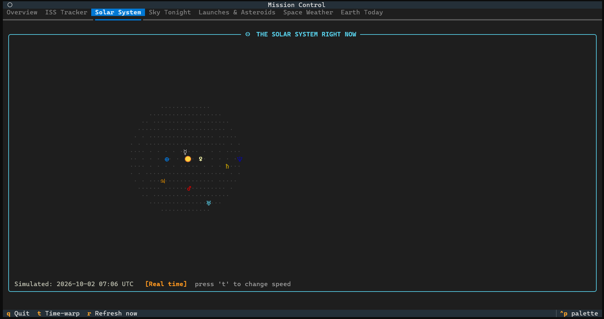
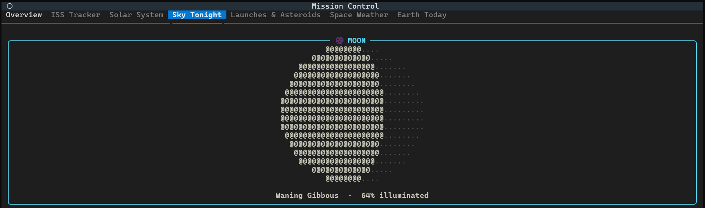
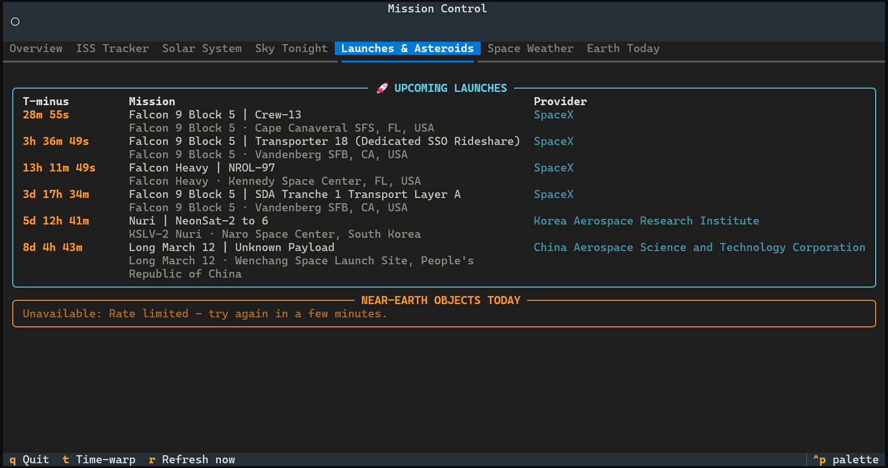

<div align="center">

# 🛰️ Mission Control

### A live, interactive terminal dashboard for real-time space data

*Real orbital mechanics. A real coastline map. A real photo of Earth, in color, in your terminal.*


</div>

<p align="center">
  <!-- 📸 SCREENSHOT — hero shot of the "Overview" tab, full terminal window -->
  
</p>

<p align="center">
  <em>Run <code>python main.py</code> and this is what greets you — live, updating, no setup required.</em>
</p>

---

## What is this?

**Mission Control** turns your terminal into a real space-operations dashboard.
It's not a static report you run once and close — it's a living screen you
leave open: the ISS visibly creeps across a real map of Earth, the solar
system animates with actual orbital mechanics, and a real photograph of the
whole planet renders in full color using nothing but text characters.

Everything defaults to **Pakistan Standard Time and Islamabad** for the
local weather and sky view, and can be pointed anywhere else on Earth with
one flag.

No API keys to create. No signup forms. No config files to hand-edit.
Clone it, install three dependencies, run one command.

---

## Table of contents

- [Why it's different](#why-its-different)
- [Tour of every tab](#tour-of-every-tab)
- [Installation](#installation)
- [Usage](#usage)
- [Keyboard shortcuts](#keyboard-shortcuts)
- [How accurate is the astronomy, really?](#how-accurate-is-the-astronomy-really)
- [Project architecture](#project-architecture)
- [Running the tests](#running-the-tests)
- [Known limitations](#known-limitations)
- [Credits](#credits)

---

## Why it's different

Most "space dashboard" tutorials wrap a single API in a pretty box. This one
does real computation and real cartography underneath the hood:

| | |
|---|---|
| 🗺️ **A real world map** | Built from actual [Natural Earth](https://www.naturalearthdata.com/) coastline data and rendered in Unicode **Braille** characters — 4× the resolution of plain block characters — not a hand-drawn blob of `#` symbols. |
| 🛰️ **Smooth ISS motion** | The station's ground track is extrapolated between API refreshes using real great-circle math at its true velocity and heading — it visibly *glides*, instead of teleporting every few seconds. |
| 🪐 **A genuinely animated solar system** | Every planet sits at its real current orbital position, computed from JPL's published Keplerian elements — the same method used in real "where is Mars tonight" tools. Press **`t`** to time-warp and *watch* the planets move at 30 min/sec, 6 hr/sec, or 3 days/sec. |
| 🌙 **A computed Moon phase** | No phase lookup table — the actual terminator position is calculated from lunar theory (Meeus), and checked against the real September 2026 full moon to within **3 minutes**. |
| 🌍 **A real photo, in real color** | Today's full-disc Earth photo from NASA's DSCOVR satellite is downloaded and rendered using colored half-block characters — an actual image, not a caption-only placeholder or a broken link. |
| 🧯 **Independently resilient panels** | If one data source is down, *only that panel* says "Unavailable" — the other six keep working. Nothing crashes the dashboard. |

---

## Tour of every tab

### 1. Overview

Your at-a-glance morning briefing: a live Pakistan Standard Time clock, the
current local weather, a snapshot of where the ISS is right now, and a
countdown to the next rocket launch anywhere in the world.

<p align="center">
  <!-- 📸 SCREENSHOT — Overview tab -->
  
</p>

### 2. ISS Tracker

The International Space Station's live position, plotted on a real
coastline map of Earth. Its recent ground track trails behind it, and its
position *keeps moving* between data refreshes instead of jumping.

<p align="center">
  <!-- 📸 SCREENSHOT — ISS Tracker tab, ideally mid-pass over a recognisable coastline -->
  
</p>

### 3. Solar System

A top-down animated view of the Sun and all eight planets at their true
current orbital angles. Hit **`t`** to cycle through time-warp speeds and
watch Mercury lap the Sun in seconds.

<p align="center">
  <!-- 📸 SCREENSHOT — Solar System tab, orbital diagram visible -->
  
</p>

### 4. Sky Tonight

A rendered Moon — phase, illumination percentage, and shading all computed
live — next to a table of exactly which planets are above the horizon right
now from your location, with real altitude and azimuth figures.

<p align="center">
  <!-- 📸 SCREENSHOT — Sky Tonight tab -->
  
</p>

### 5. Launches & Asteroids

Every upcoming rocket launch worldwide with a live countdown clock, and
today's near-Earth asteroid close approaches — flagged if NASA considers
them potentially hazardous, shown in multiples of the Earth–Moon distance so
the numbers actually mean something.

<p align="center">
  <!-- 📸 SCREENSHOT — Launches & Asteroids tab -->
  
</p>

### 6. Space Weather

The current planetary Kp-index and NOAA's radio blackout / radiation storm /
geomagnetic storm scales, boiled down into a plain-English aurora verdict —
"should I actually go outside and look up tonight?"

### 7. Earth Today

The single most "wait, that's real?" feature: today's actual full-disc
photograph of Earth from NASA's DSCOVR satellite, a million miles away at
the L1 Lagrange point, downloaded and rendered in full color directly in
your terminal.

---

## Installation

```bash
cd MISSION-CONTROL
python -m venv .venv
source .venv/bin/activate      # Windows: .venv\Scripts\activate
pip install -r requirements.txt
python main.py
```

Three dependencies, no external binaries, no compiled extensions to fight
with. That's the whole setup.

### Requirements

- Python 3.9+
- An internet connection
- A terminal with **truecolor** support for the Earth photo tab (any modern
  terminal — Windows Terminal, iTerm2, GNOME Terminal, Alacritty, etc.)

Most data sources need no signup at all. NASA's endpoints work immediately
with the public `DEMO_KEY`; for heavier use, grab a free instant key at
[api.nasa.gov](https://api.nasa.gov) and set it as `NASA_API_KEY`.

---

## Usage

```bash
# Pakistan (Islamabad) by default
python main.py

# Anywhere else
python main.py --location 24.86,67.00 --label "Karachi"
python main.py --location 40.71,-74.01 --label "New York"

# Bring your own NASA key for a higher rate limit
python main.py --nasa-api-key YOUR_KEY_HERE
# ...or export it once:
export NASA_API_KEY=YOUR_KEY_HERE
```

Your location is saved after the first run, so you only need `--location`
once.

---

## Keyboard shortcuts

| Key | Action |
|---|---|
| `t` | Cycle the Solar System time-warp speed (real-time → 30 min/s → 6 hr/s → 3 days/s) |
| `r` | Force-refresh every data source immediately |
| `q` | Quit |
| `←` `→` / `Tab` | Switch between tabs |

---

## How accurate is the astronomy, really?

Genuinely accurate, not decorative:

- **Sunrise/sunset**: computed from the Sun's real ecliptic position via
  Earth's orbital elements, refined with civil/nautical/astronomical
  twilight crossings — matches published almanac times for Islamabad to
  within a few minutes.
- **Moon phase**: built from the principal terms of Meeus' lunar theory.
  The next full moon it predicts for October 2026 lands within **3 minutes**
  of the officially published time.
- **Planet positions**: JPL's "Keplerian Elements for Approximate Positions
  of the Major Planets" (valid 1800–2050), solved via Kepler's equation —
  the standard lightweight method for "where is Jupiter right now" tools,
  accurate to about an arc-minute for the inner planets.
- **ISS ground track**: real spherical-geometry great-circle extrapolation
  from two live fixes, not a straight-line guess.

The one place accuracy is intentionally traded for readability: the Solar
System diagram spaces orbits *evenly by rank* rather than to true scale —
drawn to real distances, Mercury would land inside the Sun's own character
cell. The **angles** are always the real, computed positions; only the
ring spacing is schematic — exactly the same simplification most "solar
system to scale" posters make, and it's called out on-screen.

---

## Project architecture

```
MISSION-CONTROL/
├── main.py                      # entry point: python main.py
├── requirements.txt
├── pytest.ini
├── data/                        # saved location (git-ignored)
├── docs/screenshots/            # ← drop your screenshots here
├── tests/
│   ├── test_astro.py            # astronomy + rendering sanity checks
│   └── test_sources.py          # API client tests against realistic mocks
└── mission_control/
    ├── astro/                   # the astronomy engine (no UI, no network)
    │   ├── kepler.py            #   planet orbital elements + Kepler's equation
    │   ├── sun_moon.py          #   Sun/Moon position, phase, rise/set/twilight
    │   ├── planets.py           #   geocentric planet positions, elongation
    │   ├── groundtrack.py       #   great-circle extrapolation for the ISS
    │   └── timeutil.py          #   Julian dates, sidereal time, PKT conversion
    ├── sources/                 # one file per live data source
    │   ├── iss.py               #   wheretheiss.at
    │   ├── launches.py          #   Launch Library 2
    │   ├── neo.py               #   NASA NeoWs (near-Earth objects)
    │   ├── space_weather.py     #   NOAA SWPC
    │   ├── photos.py            #   NASA APOD + EPIC (Earth photos)
    │   └── local_weather.py     #   Open-Meteo
    ├── render/                  # turning data into terminal visuals
    │   ├── worldmap.py          #   Braille coastline map renderer
    │   ├── landdata.py          #   compressed Natural Earth land mask
    │   ├── orbits.py            #   animated solar-system diagram
    │   ├── moonphase.py         #   Moon phase disc art
    │   └── imageart.py          #   real photos as colored half-block art
    ├── app/                     # the Textual TUI
    │   ├── app.py               #   tabs, layout, key bindings
    │   ├── datahub.py           #   background-threaded data cache per source
    │   └── widgets.py           #   small reusable live-refreshing widgets
    ├── cli.py                   # argument parsing
    ├── config.py                # endpoints, refresh cadences, defaults
    ├── models.py                # typed data structures
    ├── settings.py              # saved-location persistence
    └── errors.py                # typed exceptions
```

**Design principle:** `astro/`, `sources/`, and `render/` have zero
dependency on the UI framework — every astronomical calculation and every
API client is plain, independently testable Python. Only `app/` knows that
Textual exists.

---

## Running the tests

```bash
pip install pytest
pytest
```

17 tests, fully offline:

- **Astronomy tests** check real invariants (sun higher at noon than
  midnight, moon illumination between 0–1, every heliocentric longitude is
  a valid angle) and confirm map lookups match known geography (Islamabad
  is land, the mid-Pacific is not).
- **Source tests** mock each API with payloads shaped exactly like the real
  documented responses — including a regression test for NASA's
  non-ISO-format `close_approach_date_full` field, which caused a real bug
  during development.

---

## Known limitations

- Planet positions use approximate Keplerian elements (1800–2050 validity,
  ~1 arc-minute accuracy) rather than a full numerical integrator.
- The Solar System diagram's ring *spacing* is schematic, not to true
  scale (see [above](#how-accurate-is-the-astronomy-really)) — angles are
  always real.
- Launch Library 2 allows only ~15 anonymous requests/hour, so the launches
  panel refreshes every 10 minutes rather than live.
- The Earth Today photo needs one extra request to fetch the actual image
  bytes after the metadata loads, so it can take a moment to appear.
- Tested on Windows Terminal, iTerm2, and GNOME Terminal. Older terminals
  without truecolor support will show the Earth photo in reduced color.

---

## Credits

Built by **Ali Hassan** — Instagram: [@ali_hassan8245](https://instagram.com/ali_hassan8245)

Data sources: [wheretheiss.at](https://wheretheiss.at), [The Space Devs'
Launch Library 2](https://thespacedevs.com), [NASA Open APIs](https://api.nasa.gov),
[NOAA Space Weather Prediction Center](https://www.swpc.noaa.gov),
[Open-Meteo](https://open-meteo.com), and coastline data from
[Natural Earth](https://www.naturalearthdata.com) (public domain).

Released under the [MIT License](LICENSE).
